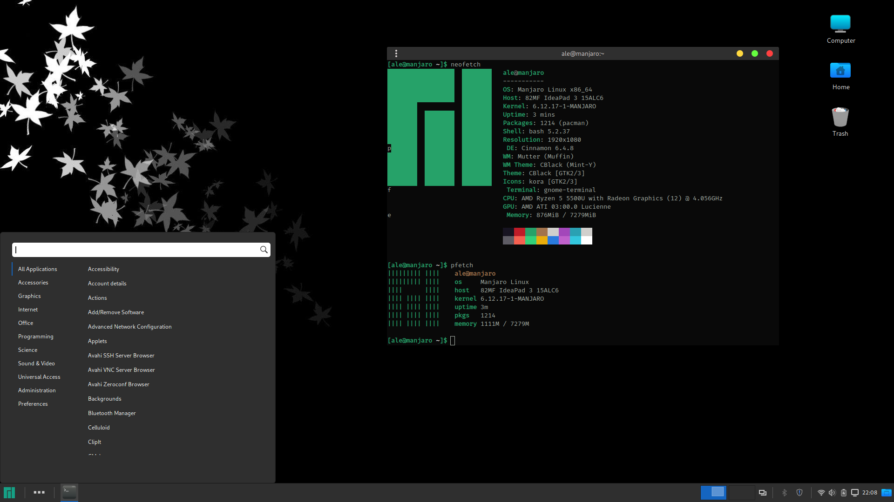

**Run Base Script**

`git clone https://github.com/alemobn/manjaro-dotfiles.git`

`chmod +x ./manjaro-dotfiles/script.sh && ./manjaro-dotfiles/script.sh`

**Breeze Cursor Install**

`sudo pacman -S breeze`

**CBlack Theme Install**

`git clone https://github.com/Cloweling/cblack.git`

`cd cblack && make install`

`cd .. && rm -rf cblack`

**Kora Icon Install**

`git clone https://github.com/bikass/kora.git`

`mkdir ~/.icons && mv kora/kora ~/.icons`

`rm -rf kora`

**Grub Theme Install**

`git clone --depth 1 https://gitlab.com/VandalByte/dedsec-grub-theme.git && cd dedsec-grub-theme
sudo python3 dedsec-theme.py --install`

`cd .. && rm -rf dedsec-grub-theme`

*--alternative grub theme*

`git clone https://github.com/sudsarkar13/Lenovo-dark-grub-4k-ubuntu`

`cd Lenovo-dark-grub-4k-ubuntu && ./install.sh`

`cd .. && rm -rf Lenovo-dark-grub-4k-ubuntu`

**BlackBox Prompt Install**

`flatpak remote-add --if-not-exists flathub https://flathub.org/repo/flathub.flatpakrepo`

`flatpak install flathub com.raggesilver.BlackBox`

**Other Features**

- Plank active ( [Theme here](https://www.gnome-look.org/p/1911700) )
- Transparent panel extension
- Jetbrains mono terminal font
- Minimal cinnamon animations
- Text scale 1.1x
- Bash or Fish shell
- Minimal menu icons
- Panel height 46px (full hd resolution)