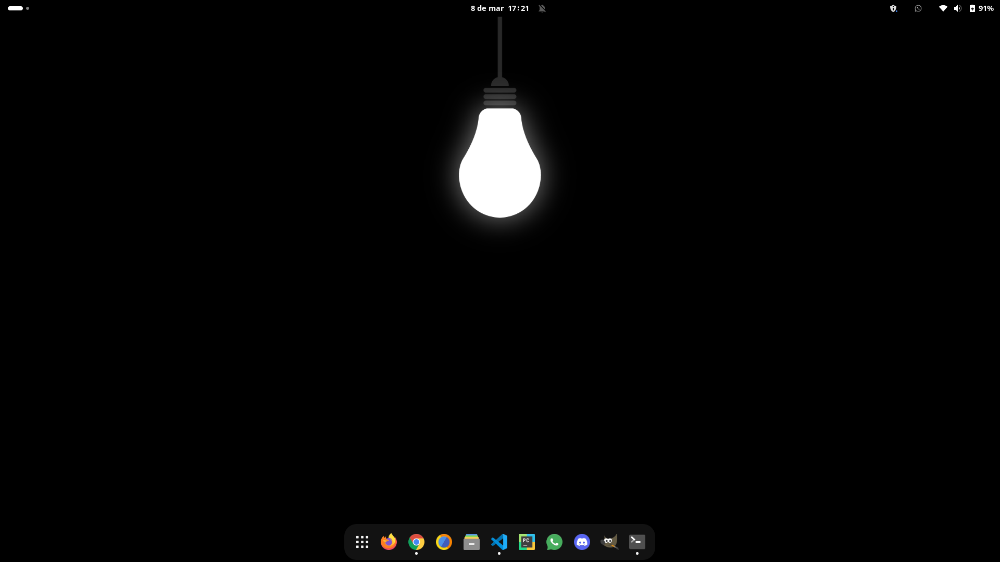

**Run Base Script**

`git clone https://github.com/alemobn/manjaro-dotfiles.git`

`chmod +x ./manjaro-dotfiles/script.sh && ./manjaro-dotfiles/script.sh`

**Breeze Cursor Install**

`sudo pacman -S breeze`

**Grub Theme Install**

`git clone --depth 1 https://gitlab.com/VandalByte/dedsec-grub-theme.git && cd dedsec-grub-theme
sudo python3 dedsec-theme.py --install`

`cd .. && rm -rf dedsec-grub-theme`

*--alternative grub theme*

`git clone https://github.com/sudsarkar13/Lenovo-dark-grub-4k-ubuntu`

`cd Lenovo-dark-grub-4k-ubuntu && ./install.sh`

`cd .. && rm -rf Lenovo-dark-grub-4k-ubuntu`

**Other Features**

- Fira Code terminal font
- Minimal gnome animations
- Bash or Fish shell