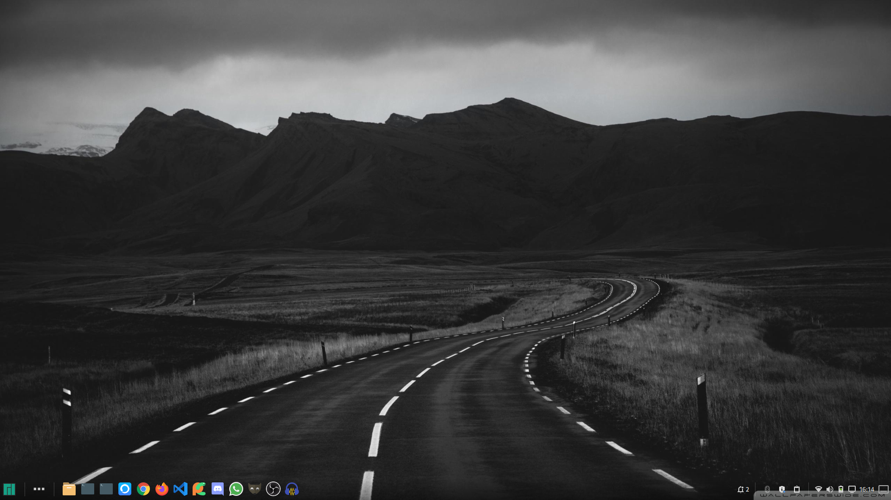
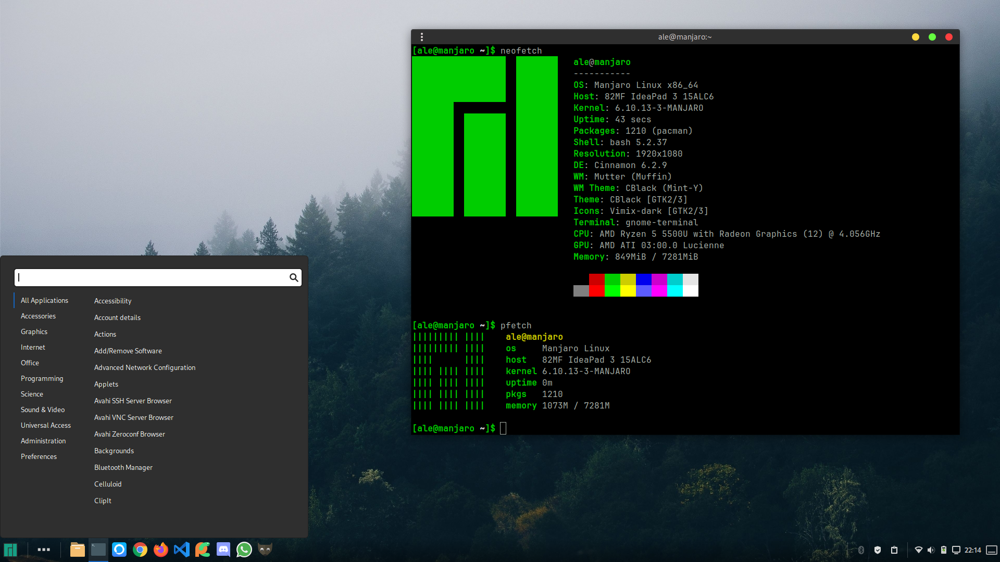

**Run Base Script**

`git clone https://github.com/alemobn/manjaro-desktop.git`

`chmod +x ./manjaro-desktop/script.sh && ./manjaro-desktop/script.sh`

**Breeze Cursor Install**

`sudo pacman -S breeze`

**CBlack Theme Install**

`git clone https://github.com/Cloweling/cblack.git`

`cd cblack && make install`

`cd .. && rm -rf cblack`

**Papirus Icon Install**

`git clone https://github.com/vinceliuice/Vimix-icon-theme.git`

`./Vimix-icon-theme/install.sh`

`rm -rf Vimix-icon-theme`

**Other Features**

- Transparent panel extension
- Jetbrains mono terminal font
- Minimal cinnamon animations
- Text scale 1.1x
- Bash or Fish shell
- Minimal menu icons
- Panel height 46px (full hd resolution)